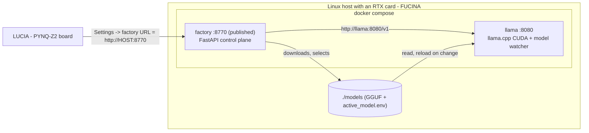

# FUCINA — the RTX knowledge-base factory, from scratch

**FUCINA** (*Fuzzy Compiler for Interpretable Neuralized Axioms*, Italian for
"forge") is the GPU half of LIMEN-AI. It runs `llama.cpp` on an NVIDIA
RTX-class card and serves a control API on port **8770**, turning your documents
into compiled, auditable knowledge bases.

It is the counterpart to **LUCIA** (*Łukasiewicz-based Unit for Continuous-logic
Inference Accelerator*), the PYNQ-Z2 board that serves the web UI and answers
queries on the FPGA. The split is deliberate: LUCIA is light and runs around the
clock on your LAN, while FUCINA is heavy and only needed while a knowledge base
is being *built*. Once a `.kbpack` is activated on the board, you can switch the
GPU machine off entirely without affecting day-to-day queries.

This is the single installation guide for the FUCINA side. Follow it top to
bottom; each step ends with a checkpoint so you can see exactly where things
stop working. The same steps apply whether the machine sits next to you or in
another room — the board reaches FUCINA by URL and does not care where it lives.



Model selection is shared state: the factory downloads a GGUF into `./models`
and rewrites `./models/active_model.env`; the watcher inside the llama container
re-execs `llama-server` on the new weights. That is what makes **Download & load**
work from the board UI without handing anyone a Docker socket.

> **A note on names.** The product is FUCINA, but two identifiers still carry the
> older `limen` naming and are correct as written: the container image
> `ghcr.io/enricozanardo/limen-factory` (GHCR cannot rename a published package)
> and the Compose service called `factory`. Commands you copy from this guide
> work as-is.

The board only ever talks to **8770**. Note that
[docker-compose.yml](../docker-compose.yml) currently also publishes the `llama`
service on **8080** across all interfaces, which is convenient for debugging but
means anything on your LAN can reach the raw model endpoint. If you would rather
keep it reachable only from the `factory` container, delete the `ports:` block
from the `llama` service and leave its `expose: "8080"` in place.

---

## Step 0 — Before you start

You need a Linux host with an NVIDIA RTX-class GPU, roughly **30 GB of free
disk** (container images plus GGUF weights), and a LAN the board can also reach.

Supported host distributions are **Ubuntu**, **Debian**, **Gentoo**,
**Fedora / RHEL / Rocky**, **Arch / Manjaro** and **openSUSE**. FUCINA itself is
always the same two-container Docker Compose stack; only the driver, Docker and
NVIDIA Container Toolkit install steps differ.

How much VRAM you have decides which model profile you can run. The profiles
come from [configs/model_catalog.json](../configs/model_catalog.json):

| Profile | Model | Weights | Needs at least |
|---------|-------|---------|----------------|
| `qwen3-4b` | Qwen3-4B (Q4) | 3 GB | 6 GB VRAM |
| `plain` | Qwen3-8B (Q4) | 6 GB | 8 GB VRAM |
| `eagle3` | Qwen3-8B + EAGLE-3 draft | 8 GB | 10 GB VRAM |
| `qwen2.5` | Qwen2.5-14B Instruct (Q4) | 9 GB | 12 GB VRAM |
| `mtp` | Qwen3.6-27B MTP (Q4) | 16 GB | 16 GB VRAM |

A 6 GB laptop card such as an RTX 4050 runs `qwen3-4b`; 8 GB and above unlock
the 8B options; `plain` is the most robust choice for study and extraction on a
12–16 GB card. The installer reads your VRAM and proposes a profile, so you do
not have to work this out yourself — the table is here so the proposal makes
sense when you see it.

### If this host already runs a native LIMEN-AI install

Check before you go further, because the Docker stack binds the same ports as
the older systemd install and the collision is not obvious from the error:

```bash
systemctl list-units --type=service | grep -i limen
ss -ltn | grep -E ':(8080|8770)'
```

If you see `limen-factory.service` or `limen-llama.service` running, stop them
before installing the Docker stack, or the containers will fail to bind 8770 and
8080:

```bash
sudo systemctl stop limen-factory.service limen-llama.service
sudo systemctl disable limen-factory.service limen-llama.service
```

Leave `limen-edge.service` alone if this same machine is also acting as an edge
node on port 8000 — that one does not conflict.

**Checkpoint:** nothing is listening on 8770 or 8080.

## Step 1 — Host prerequisites

Install the NVIDIA driver, Docker Engine with Compose v2, and the NVIDIA
Container Toolkit. The pieces differ per distribution:

| Piece | Ubuntu / Debian | Gentoo | Fedora / RHEL / Rocky | Arch | openSUSE |
|-------|-----------------|--------|------------------------|------|----------|
| Driver | `ubuntu-drivers install` | `emerge x11-drivers/nvidia-drivers` | distro NVIDIA package | `nvidia` / `nvidia-dkms` | NVIDIA repo |
| Docker + Compose v2 | Docker CE apt repo | `app-containers/docker` + `docker-cli` | `docker` + compose plugin | `docker` + `docker-compose` | Docker CE |
| NVIDIA Container Toolkit | NVIDIA deb repo | `app-containers/nvidia-container-toolkit` | libnvidia-container RPM repo | `nvidia-container-toolkit` | same RPM repo |
| Restart Docker | `systemctl restart docker` | `rc-service docker restart` (OpenRC) or systemd | `systemctl restart docker` | systemd | systemd |

### Ubuntu / Debian (worked example)

```bash
sudo apt update && sudo apt -y upgrade
sudo apt -y install curl git ca-certificates
sudo ubuntu-drivers install && sudo reboot
nvidia-smi

# Docker CE (not the snap / docker.io package)
sudo install -m 0755 -d /etc/apt/keyrings
sudo curl -fsSL https://download.docker.com/linux/ubuntu/gpg -o /etc/apt/keyrings/docker.asc
sudo chmod a+r /etc/apt/keyrings/docker.asc
echo "deb [arch=$(dpkg --print-architecture) signed-by=/etc/apt/keyrings/docker.asc] \
https://download.docker.com/linux/ubuntu $(. /etc/os-release && echo "$VERSION_CODENAME") stable" \
  | sudo tee /etc/apt/sources.list.d/docker.list >/dev/null
sudo apt update
sudo apt -y install docker-ce docker-ce-cli containerd.io \
                    docker-buildx-plugin docker-compose-plugin
sudo usermod -aG docker "$USER"
newgrp docker
```

### Gentoo, OpenRC (worked example)

```bash
# 1) NVIDIA driver — then reboot and confirm
emerge -av x11-drivers/nvidia-drivers
nvidia-smi

# 2) Docker Engine + Compose v2
emerge -av app-containers/docker app-containers/docker-cli
rc-update add docker default && rc-service docker start
docker version && docker compose version

# 3) NVIDIA Container Toolkit
emerge -av app-containers/nvidia-container-toolkit
nvidia-ctk runtime configure --runtime=docker
rc-service docker restart

# Optional: whiptail for the installer TUI
emerge -av dev-libs/newt
```

If your Gentoo profile uses systemd instead of OpenRC, replace the `rc-service`
and `rc-update` lines with `systemctl enable --now docker` and
`systemctl restart docker`.

**Checkpoint:** `nvidia-smi` prints your card, and `docker compose version`
reports v2.

## Step 2 — Prove the GPU is visible inside Docker

This is the one thing that cannot be containerised away, and the single most
common reason an install fails later. After
`nvidia-ctk runtime configure --runtime=docker`, restart Docker with whichever
service manager you actually run, then:

```bash
docker run --rm --gpus all nvidia/cuda:12.4.1-base-ubuntu22.04 nvidia-smi
```

The repository ships a helper that does the install and the check for you across
all five package managers, detecting systemd or OpenRC for the Docker restart:

```bash
./install/rtx_preflight.sh --install    # install driver/toolkit where scriptable
./install/rtx_preflight.sh --verify     # just run the check
```

**Checkpoint:** the GPU appears in the output of a command running *inside a
container*. If it does not, stop here — nothing downstream will work.

## Step 3 — Get the tree

### Operators (public `fucina` repo)

```bash
git clone https://github.com/enricozanardo/fucina.git
cd fucina
```

No GitHub token and no `docker login`: the factory image on GHCR is public.

### Developers (private accelerator)

```bash
git clone git@github.com:enricozanardo/limen-ai-accelerator.git
cd limen-ai-accelerator
```

The presence of `docker/Dockerfile` makes the installer **build** the image from
source via `docker-compose.build.yml` instead of pulling it.

**Checkpoint:** you are in a directory containing `docker-compose.yml`,
`install/` and `configs/model_catalog.json`.

## Step 4 — Install

```bash
./install/fucina.sh
```

The menu covers install and repair, change model, update, status, logs, board
pairing and uninstall. It prefers **whiptail**, falls back to **dialog**, then to
plain prompts, so a minimal box without `dev-libs/newt` still works.

Non-interactive:

```bash
./install/fucina.sh --no-tui install
```

Either way the install does the same four things: runs the preflight from Step 2;
reads your VRAM and proposes a catalogue profile that fits, letting you set the
context size; writes `docker/factory.env`, then pulls or builds the images and
starts the stack; and finally waits for `/health` and a `/translate` smoke test
before printing the LAN URL you will pair the board to.

The older scripts still work if you prefer them directly:

```bash
./install/rtx_preflight.sh --verify
./install/rtx_factory_docker.sh
```

**Checkpoint:** `docker compose --env-file docker/factory.env ps` shows the
`llama` and `factory` services up.

## Step 5 — Verify

```bash
curl -s http://127.0.0.1:8770/health
```

A healthy factory answers with something like this — captured from a live
LIMEN-AI host with an RTX 4080 Laptop GPU:

```json
{
    "status": "ok",
    "version": "4.0.0",
    "hostname": "nabla",
    "gpu": true,
    "gpu_name": "NVIDIA GeForce RTX 4080 Laptop GPU",
    "vram_total_mb": 12282,
    "vram_used_mb": 8440,
    "llm_reachable": true,
    "llm_base_url": "http://127.0.0.1:8080/v1",
    "llm_model": "qwen3-8b",
    "llm_spec": "none",
    "llm_managed_by": "systemd",
    "llm_process_running": true,
    "llm_served": ["qwen3-8b"]
}
```

That sample comes from the native systemd install, so two fields read
differently on the Docker path you have just followed: `llm_managed_by` will be
`"docker"`, and `llm_base_url` will be the internal `http://llama:8080/v1`.
Everything else has the same shape.

The fields that matter are `gpu: true`, a non-zero `vram_total_mb` (the board UI
needs it to size models), `llm_reachable: true`, and your chosen alias present in
`llm_served`. If `vram_total_mb` is 0, the NVIDIA runtime is not injecting
`nvidia-smi` into the factory container — go back to Step 2, or as a last resort
set `LIMEN_VRAM_TOTAL_MB` and `LIMEN_GPU_NAME` in `docker/factory.env` and
recreate the container.

### Context sizing

| GPU VRAM | Suggested `LIMEN_LLAMA_CTX` | Typical profile |
|----------|-----------------------------|-----------------|
| 6 GB | `4096` (default for small cards) | `qwen3-4b` |
| 8 GB | `4096`–`8192` | `plain` |
| 12 GB | `8192` | `plain` / `eagle3` / `qwen2.5` |
| 16 GB+ | `8192` | any catalogue profile that fits |

Do **not** drop to `2048`. That is what makes natural-language queries fail with
`exceed_context_size_error`.

**Checkpoint:** `/health` reports `gpu: true`, `llm_reachable: true`, and a
non-zero `vram_total_mb`.

## Step 6 — Choose a model from the LUCIA UI

Open the board UI, go to **Settings**, and find *RTX workstation · local models*.
The catalogue is split into what your card can hold and what it cannot, with one
row marked **recommended**. **Download & load** fetches the GGUF onto the FUCINA
host and reloads `llama.cpp` on it.

Under the hood this is the shared-state mechanism from the diagram above: the
factory writes the GGUF and `active_model.env` into `./models`, and the watcher
in the llama container notices the change and re-execs `llama-server`. Nothing
needs a Docker socket, which is why the board can drive it safely over the LAN.

**Checkpoint:** after the load finishes, the new alias appears in `llm_served`
in `/health`.

## Step 7 — Pair LUCIA to FUCINA

Find the LAN address of the FUCINA host and confirm the board can reach it:

```bash
ip -4 -o addr show scope global | awk '!/docker|br-|veth/ {print $4}'
curl -s http://<that-ip>:8770/health          # from the FUCINA host
```

Then run the same curl **from the board** to prove the path works, and set
Settings → factory URL = `http://<that-ip>:8770` in the LUCIA UI.

If the host answers locally but the board cannot reach it, the cause is almost
always a host firewall or Wi-Fi client isolation between the two. Open TCP 8770
to the LAN and disable client isolation on the access point. Do not expose 8770
to the open internet; for a remote factory use a private overlay such as
WireGuard or Tailscale.

**Checkpoint:** the board's Settings page reports the factory reachable, with
the LLM reachable too.

## Step 8 — Build and query your first knowledge base

You now have a working appliance, so close the loop before trusting it. In the
LUCIA UI, add a domain and its trusted sources, then build a knowledge base: the
board relays the documents to FUCINA, which compiles them and returns a
`.kbpack`. Activate the pack and ask a question.

Queries run locally on the board's FPGA and each one is written to the on-board
audit trail, so the reasoning stays traceable. Knowledge bases record their
origin — which factory built them and when — so if you ever move to a different
FUCINA host you can still tell at a glance where each pack came from.

**Checkpoint:** a question against your own knowledge base returns an answer
with a per-rule trace.

## Step 9 — Day-to-day operation

```bash
./install/fucina.sh status
./install/fucina.sh logs
./install/fucina.sh update          # pull a newer image tag and restart
```

Manual Compose, using the same env file the installer wrote:

```bash
E="--env-file docker/factory.env"
# developers also add: -f docker-compose.yml -f docker-compose.build.yml
docker compose $E ps
docker compose $E logs -f llama
docker compose $E pull && docker compose $E up -d
```

Compiled packs live under `./data/factory` and GGUFs under `./models`; both
survive `down` and `up`. Once a knowledge base is activated on the board, you can
shut FUCINA down until you next need to build or grow one.

## Step 10 — Troubleshooting

**`llm_reachable` stays false.** The first model load takes a while. Wait one to
two minutes, then `docker compose $E logs --tail=80 llama`.

**`vram_total_mb` is 0.** The NVIDIA runtime is not injecting `nvidia-smi` into
the factory container. Re-run Step 2 and `rtx_preflight.sh --verify`.

**`cudaMalloc failed`.** You are out of VRAM. Close other GPU applications, drop
the context one row in the sizing table, or pick a smaller profile (`qwen3-4b` on
a 6 GB card).

**Load times out mentioning the model watcher.** Recreate the container once:
`docker compose $E up -d --force-recreate llama`.

**Ports 8770 or 8080 already in use.** A native systemd install is still running.
See the check at the end of Step 0.

**`docker pull` fails for `limen-factory`.** Confirm the package is public at
<https://github.com/users/enricozanardo/packages/container/package/limen-factory>
(Package settings → Change visibility → Public). No `docker login` is needed.
Also check that the tag in `docker/factory.env` actually exists — `LIMEN_VERSION`
must match a published tag, not just the local `VERSION` file.

---

## Appendix A — Windows laptop with WSL2

Install the NVIDIA **Windows** driver, enable systemd in `/etc/wsl.conf` and
mirrored networking in `%UserProfile%\.wslconfig`. Then follow the Ubuntu path
inside WSL, skipping the Linux driver step.

## Appendix B — In-tree factory without Docker (developers)

```bash
./install/limen_factory_install.sh
./install/install_host_services.sh
```

This is the native systemd path — `limen-factory.service`, `limen-llama.service`
— and it is only for developing the factory source. It binds the same ports as
the Docker stack, so run one or the other, never both. Operators should use
Docker.

## Appendix C — Cutting a release (maintainers)

Tag the private accelerator:

```bash
git tag v4.0.2 && git push --tags
```

[.github/workflows/release.yml](../.github/workflows/release.yml) then builds and
pushes `ghcr.io/enricozanardo/limen-factory:<version>` and syncs the curated
bootstrap files into the public
[fucina](https://github.com/enricozanardo/fucina) repository.

Two things to keep an eye on. The GHCR package must stay **public** so operators
need no token; if a release re-links it as private, flip it back under Package
settings → Change visibility. And the `PUBLIC_REPO_TOKEN` secret must be set on
the private repository, or the sync job skips silently rather than failing.

Bumping `VERSION` on its own does not publish anything. Until the matching `v*`
tag is pushed and the workflow completes, that version does not exist on GHCR,
and an install that asks for it will fail to pull.
