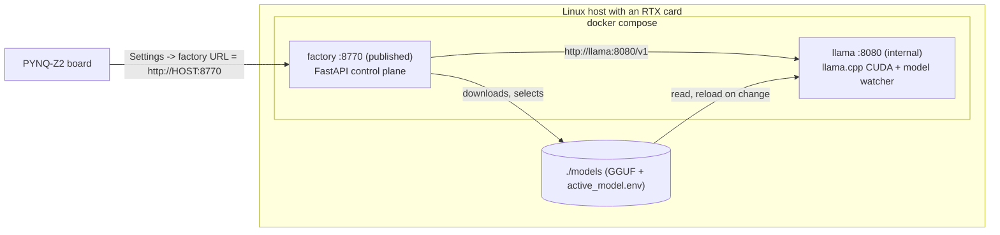

# RTX factory — install from scratch (any Linux + Docker)

This is the single installation guide for the **RTX part** of LIMEN-AI: the
knowledge-base factory that runs `llama.cpp` on an NVIDIA RTX-class GPU and
serves the board on port 8770. It ends with a factory the PYNQ-Z2 appliance can
build against.

The same steps apply whether the machine sits next to you (a laptop with an RTX
card) or in another room: the factory is reached by URL, and the board does not
care where it lives. Supported host distributions include **Ubuntu**, **Debian**,
**Gentoo**, **Fedora / RHEL / Rocky**, **Arch / Manjaro** and **openSUSE**. The
factory itself is always **Docker Compose with two containers** — only the
driver, Docker and NVIDIA Container Toolkit install steps differ by distro.



Model selection is shared state: the factory downloads a GGUF into `./models`
and rewrites `./models/active_model.env`; the watcher inside the llama container
re-execs `llama-server` on the new weights. That is what makes **Download & load**
work from the board UI without a Docker socket.

---

## 1. Choose your path

| Path | Who | What you install |
|------|-----|------------------|
| **Public bootstrap (`limen-rtx`)** | Buyers / operators | Clone the public repo, run the TUI. Pulls `ghcr.io/enricozanardo/limen-factory:<version>` (private package; needs a read-only PAT). |
| **Private accelerator tree** | Developers | This repository. Builds the factory image from `docker/Dockerfile` via `docker-compose.build.yml`. |

You need roughly **30 GB of free disk** (container images + GGUF weights). A 6 GB
card (e.g. RTX 4050) is supported via the **Qwen3-4B** catalogue profile; 8 GB
and above unlock the 8B/14B options.

## 2. Host prerequisites by distribution

| Piece | Ubuntu / Debian | Gentoo | Fedora / RHEL / Rocky | Arch | openSUSE |
|-------|-----------------|--------|------------------------|------|----------|
| Driver | `ubuntu-drivers install` | `emerge x11-drivers/nvidia-drivers` | distro NVIDIA package | `nvidia` / `nvidia-dkms` | NVIDIA repo |
| Docker + Compose v2 | Docker CE apt repo | `app-containers/docker` + `docker-cli` | `docker` + compose plugin | `docker` + `docker-compose` | Docker CE |
| NVIDIA Container Toolkit | NVIDIA deb repo | `app-containers/nvidia-container-toolkit` | libnvidia-container RPM repo | `nvidia-container-toolkit` | same RPM repo |
| Restart Docker | `systemctl restart docker` | `rc-service docker restart` (OpenRC) or systemd | `systemctl restart docker` | systemd | systemd |

After `nvidia-ctk runtime configure --runtime=docker`, restart Docker with the
service manager you actually run. The universal check is the same everywhere:

```bash
docker run --rm --gpus all nvidia/cuda:12.4.1-base-ubuntu22.04 nvidia-smi
```

### 2.1 Ubuntu / Debian (worked example)

```bash
sudo apt update && sudo apt -y upgrade
sudo apt -y install curl git ca-certificates
sudo ubuntu-drivers install && sudo reboot
nvidia-smi

# Docker CE (not the snap / docker.io package)
sudo install -m 0755 -d /etc/apt/keyrings
sudo curl -fsSL https://download.docker.com/linux/ubuntu/gpg -o /etc/apt/keyrings/docker.asc
sudo chmod a+r /etc/apt/keyrings/docker.asc
echo "deb [arch=$(dpkg --print-architecture) signed-by=/etc/apt/keyrings/docker.asc] \
https://download.docker.com/linux/ubuntu $(. /etc/os-release && echo "$VERSION_CODENAME") stable" \
  | sudo tee /etc/apt/sources.list.d/docker.list >/dev/null
sudo apt update
sudo apt -y install docker-ce docker-ce-cli containerd.io \
                    docker-buildx-plugin docker-compose-plugin
sudo usermod -aG docker "$USER"
newgrp docker
```

Or let the installer install the toolkit for you:

```bash
./install/rtx_preflight.sh --install
./install/rtx_preflight.sh --verify
```

### 2.2 Gentoo (OpenRC worked example)

Validated shape: physical laptop with an RTX card, still running the **Docker**
stack (not a Docker-free native build).

```bash
# 1) NVIDIA driver — then reboot and confirm
emerge -av x11-drivers/nvidia-drivers
nvidia-smi

# 2) Docker Engine + Compose v2
emerge -av app-containers/docker app-containers/docker-cli
rc-update add docker default && rc-service docker start
docker version && docker compose version

# 3) NVIDIA Container Toolkit
emerge -av app-containers/nvidia-container-toolkit
nvidia-ctk runtime configure --runtime=docker
rc-service docker restart

# Optional: whiptail for the installer TUI
emerge -av dev-libs/newt
```

Then:

```bash
./install/rtx_preflight.sh --verify
# or: ./install/rtx_preflight.sh --install
```

If your Gentoo profile uses systemd instead of OpenRC, replace the
`rc-service` / `rc-update` lines with `systemctl enable --now docker` and
`systemctl restart docker`.

## 3. Obtain the tree

### Buyers (public `limen-rtx`)

```bash
git clone https://github.com/enricozanardo/limen-rtx.git
cd limen-rtx
```

Create a **read-only** GitHub personal access token that can pull private packages
from `ghcr.io` (classic: `read:packages`, or a fine-grained token with package
read on `limen-factory`). You will paste it into the installer once; afterwards
`docker login` is reused.

### Developers (private accelerator)

```bash
git clone git@github.com:enricozanardo/limen-ai-accelerator.git
cd limen-ai-accelerator
```

A local `docker/Dockerfile` means the installer **builds** the factory image
instead of pulling from GHCR.

## 4. Install with the TUI (recommended)

```bash
./install/limen-rtx.sh
```

The menu covers install/repair, change model, update, status, logs, board
pairing and uninstall. It prefers **whiptail**, then **dialog**, then plain
prompts (so a minimal Gentoo box without `dev-libs/newt` still works).

Non-interactive:

```bash
LIMEN_GHCR_TOKEN=ghp_… ./install/limen-rtx.sh --no-tui install
# developers (local build — no token needed):
./install/limen-rtx.sh --no-tui install
```

What install does:

1. Runs `rtx_preflight.sh` (GPU visible inside Docker).
2. Logs in to GHCR when no Dockerfile is present.
3. Reads host VRAM, proposes a catalogue profile that fits (e.g. **qwen3-4b** on
   a 6 GB card, **plain** on 12 GB+), lets you set context.
4. Writes `docker/factory.env`, pulls or builds, starts the stack, waits for
   `/health` and a `/translate` smoke test.
5. Prints the LAN URL for board pairing.

You can still call the older scripts directly:

```bash
./install/rtx_preflight.sh --verify
./install/rtx_factory_docker.sh
```

## 5. Verify

```bash
curl -s http://127.0.0.1:8770/health
```

Expect something like:

```json
{"status":"ok","version":"3.1.0","gpu":true,
 "gpu_name":"NVIDIA GeForce RTX 4050 Laptop GPU",
 "vram_total_mb":6141,"llm_reachable":true,
 "llm_managed_by":"docker","llm_process_running":true,
 "llm_served":["qwen3-4b"]}
```

`vram_total_mb` must be non-zero so the board UI can size models. If it is 0,
fix the NVIDIA runtime or set `LIMEN_VRAM_TOTAL_MB` / `LIMEN_GPU_NAME` in
`docker/factory.env` and recreate the factory container.

### Context sizing

| GPU VRAM | Suggested `LIMEN_LLAMA_CTX` | Typical profile |
|----------|-----------------------------|-----------------|
| 6 GB | `4096` (default for small cards) | `qwen3-4b` |
| 8 GB | `4096`–`8192` | `plain` |
| 12 GB | `8192` | `plain` / `eagle3` / `qwen2.5` |
| 16 GB+ | `8192` | any catalogue profile that fits |

Do **not** drop to `2048` — that is what makes NL queries fail with
`exceed_context_size_error`.

## 6. Choosing a model from the board UI

Open the board UI → **Settings** → *RTX workstation · local models*. The catalogue
is split into what your card can hold and what it cannot; one row is marked
**recommended**. **Download & load** fetches the GGUF onto this host and reloads
llama.cpp; success means the new alias is in `llm_served`.

Profiles live in `configs/model_catalog.json` (shared by the factory, the curl
fetcher and the TUI).

## 7. Pair the board

```bash
ip -4 -o addr show scope global | awk '!/docker|br-|veth/ {print $4}'
curl -s http://<that-ip>:8770/health          # from this host
# from the board:
curl -s http://<that-ip>:8770/health
```

Then Settings → factory URL = `http://<that-ip>:8770`.

If the host works but the board does not, open TCP 8770 on the firewall and
disable Wi-Fi client isolation. Do not expose 8770 on the open internet; use a
private overlay (WireGuard, Tailscale, …) for remote factories.

## 8. Operations and updates

```bash
./install/limen-rtx.sh status
./install/limen-rtx.sh logs
./install/limen-rtx.sh update          # pull newer limen-factory tag + restart
```

Manual Compose (same env file the installer wrote):

```bash
E="--env-file docker/factory.env"
# developers also add: -f docker-compose.yml -f docker-compose.build.yml
docker compose $E ps
docker compose $E logs -f llama
docker compose $E pull && docker compose $E up -d
```

Compiled packs live under `./data/factory`; GGUFs under `./models`. Both survive
`down` / `up`.

Releasing a new version (maintainers): tag the private accelerator
(`git tag v3.2.0 && git push --tags`). `.github/workflows/release.yml` builds and
pushes `ghcr.io/enricozanardo/limen-factory:<version>` and syncs the curated
bootstrap files into `limen-rtx`. The GHCR package stays **private**; set the
`PUBLIC_REPO_TOKEN` secret on the private repo so the public tree can update.

## 9. Troubleshooting

**`llm_reachable` stays false.** Wait 1–2 minutes on first load, then
`docker compose $E logs --tail=80 llama`.

**`vram_total_mb` is 0.** NVIDIA runtime not injecting `nvidia-smi` into the
factory container — re-run section 2 / `rtx_preflight.sh --verify`.

**`cudaMalloc failed`.** Close other GPU apps; drop context one row; pick a
smaller profile (`qwen3-4b` on 6 GB).

**Load times out mentioning the model watcher.** Recreate once:
`docker compose $E up -d --force-recreate llama`.

**GHCR pull denied.** `docker login ghcr.io` with a read-only PAT, or set
`LIMEN_GHCR_TOKEN` before `./install/limen-rtx.sh`.

---

## Appendix A — Windows laptop with WSL2

Install the NVIDIA **Windows** driver; enable systemd in `/etc/wsl.conf` and
mirrored networking in `%UserProfile%\.wslconfig`. Then follow the Ubuntu path
inside WSL (skip the Linux driver step).

## Appendix B — In-tree factory without Docker (developers)

```bash
./install/limen_factory_install.sh
./install/install_host_services.sh
```

Only for developing the factory source. Buyers and Gentoo operators use Docker.
